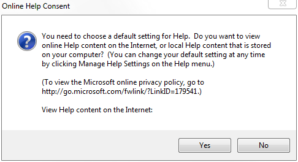
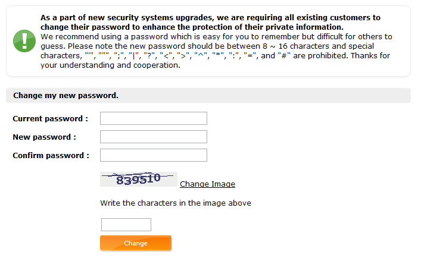

Coming right at you, with two crappy implementations I’ve seen tonight. (append: I’m not sure I’m too crazy about tumblr’s slideshow widget - I think it should be optional - in a post like this, I’d rather toss the screenshot in the post and forego the widget alltogether…)

The first one is an abomination. It’s found in Visual Studio 2010 - I accidentally hit F1, and was greeted with this beauty. Where do I begin? Giant wall of meaningless text? The fact that the URL given is neither click-able nor copy/paste-able? Or the fact that they end their final question with a colon, rather than a question mark? Ugh…

The second one I ran into logging into a website. They upgraded their security systems, but apparently forgot to remove the retarded password restrictions. I cannot fathom why anyone sets a maximum length on a password, or specifies that characters like quotes and punctuation cannot appear in them. One would think that they’re just storing a hash of the password in a database someplace - rendering these silly restrictions obsolete. But, I digress…