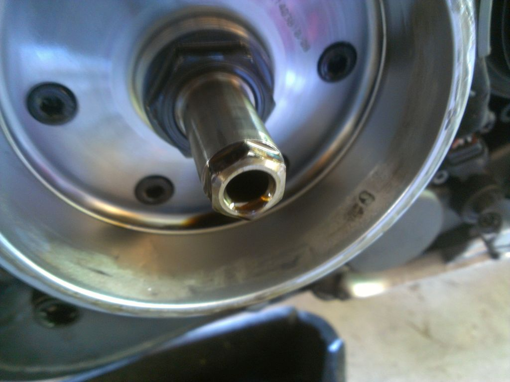

# Buell 1125CR Charging System Overhaul

This writeup covers the charging system work I did on my 2009 Buell 1125CR. It
should apply to any 2009 or 2010 Buell 1125 motorcycle. This writeup is provided
for informational purposes only; I accept no responsibility for the results of
applying this information.

## Introduction

The 2009 and 2010 Buell 1125 motorcycles (the 1125R and the 1125CR) are
notorious for their charging system issues. In 2009, the stator output was
increased, and due to the use of a shunt-style regulator, this lead to higher
stator temperatures. Take this increased heat and add the fact that there is
very little air or oil flow to the stator, and it's easy to see why these
stators fail often. Eventually, the heat breaks down the insulation on the
stator windings, causing a short. A shorted winding takes out two of the three
phases, leaving you at roughly one-third electrical capacity.

When I bought my 2009 1125CR, it still had the original factory charging system.
I began to make some preventive upgrades, but the damage was already done. Once
my stator failed, I was lucky enough to have research and discussion from
several other people available to me online. Leveraging this, I overhauled my
charging system. My new system has been rock solid for the past several thousand
miles, and I am confident that the original shortcomings have been fixed, and
that the problem is solved for good on my bike.

Many others have purchased and installed 2008-spec stators and rotors, as those
were reliable. However, this solution didn't appeal to me. My goal was to fix
the 2009-spec system, and maintain the higher charging system output. These
machines tend to run hot and, when running on full blast, the electric cooling
fans can overtax the charging system while idling. Getting caught in traffic
with a motorcycle on a hot day can be stressful enough without worrying about
your charging system!

My solution is similar to one by Gregory Hildstrom. In fact, his extensive
documentation is what inspired me to tackle the task. There is a link to his
writeup, among other useful links, in the _more reading_ section at the bottom.

The overhauled charging system on my machine has been changed in several ways:

* Rotor was replaced with one that sprays oil on the stator
* Stator was rewound with high temperature wire and high temperature epoxy
* Regulator was replaced with a series regulator

## Rotor Replacement

The stock rotor is nothing special. It's pretty typical of similar charging
systems -- just a spinning permanent magnet whose purpose is to induce
electrical current in the stator windings. It forms a pretty close fit with the
stator, and doesn't allow very much oil or air past it at all. For a stator
that's constantly overheated, lack of oil- and air-flow is not your friend.

It turns out that the crankshaft has an oil port where the rotor bolts on. Very
convenient, as this means with a specially machined rotor, we can get some oil
flow to the stator.

Erik Buell Racing, in their very gracious support of the 1125 platform,
developed and released such a rotor! The cost of this rotor is $425, $250 of
which is a core charge that gets refunded upon return of your original rotor.

I purchased one for installation on my machine. I needed to tear it down to do a
valve check anyway, so this gave me the perfect opportunity to kill two birds
with one stone.

If you look carefully at the photo of the rotor above, you can see the tiny oil
spraying hole in the area circled in yellow. It looks tiny, but it doesn't take
a very big hole to spray enough oil to cool things down.

### Materials Required

When I did this, some parts had to be ordered from Harley Davidson. Now, EBR
offers most, if not all, of these parts.

* EBR modified rotor
* Hardened crankshaft locking tool
* Replacement rotor nut
* Loctite 272 (or Permatex 27200 - same thing, same company, but much easier to
  find) - for rotor nut
* Loctite 648 - for sprag clutch bolts
* Ignition cover gasket - it's only paper, and easy to tear during removal

### Installation

Installation of this new rotor is definitely not for the faint of heart. The nut
that holds it on needs to be heated up for removal, and needs to be installed to
a high torque value.

#### Crankshaft Locking Tool

A special locking tool is required to lock the crankshaft in place while
applying the torque required to remove and install the rotor nut. From time to
time, you can buy one of these from EBR. However, it was out of stock for quite
a while when I was looking for one, and I was ultimately unable to source one. I
attempted to make my own, but it didn't work out very well.

I drilled out an appropriately sized bolt (to protect the threads in the engine
casing), and used an appropriately sized hardened steel rod.

I was able to get the crankshaft locked with the tool, however, the tool slipped
out of the hole with only around 50 ft-lbs of torque applied. Rotor nut
installation requires 295 ft-lbs, so this was nowhere near enough! _Note: I
wouldn't recommend attempting to DIY this tool, unless you or someone you know
is skilled in toolmaking. I've read reports of others not faring as lucky as I
did, and having the tool break off rather than slip. If you have something break
off in the crankshaft, it **will** ruin your day!_

I had an air impact that was rated for 300 ft-lbs tightening, which is just
beyond the torque spec from EBR. Many people recommend not using an impact
wrench for installing bolts like this. I did, and it worked out fine, but you
will have to weigh the risks involved before deciding to do so yourself.

#### Removal of Rotor Nut and Rotor

Removal of the rotor begins with dissembling the motor to get to the rotor. This
isn't particularly difficult, but there are several steps involved. I'd
recommend consulting a service manual here if you're not familiar with the
process. The rotor nut torquing process has been revised by EBR, however. The
torquing instructions and threadlocker specifications I give below will disagree
with your service manual, but are in fact correct as of this writing.

Since the locking tool I made wouldn't hold enough torque to remove the nut, I
used the impact to remove it. The DIY
locking tool _did_ hold enough to keep the crankshaft still during impact use,
but in retrospect, it was probably a bad idea to continue using the tool in this
manner.

Some folks report being able to remove the nut with very little force and
without needing to heat the nut to release the Loctite already installed. I had
no such luck. I used a small hand-held torch to apply heat to the nut for
several seconds, then hit it with the impact. After going back and forth a
couple of times, it came off. Careful with the heat though -- too much can
affect the magnets in the rotor -- so try and keep it localized to the nut.

After removing the nut, the rotor (and sprag clutch attached to the back) slid
right off the crankshaft.

#### Preparation of New Rotor

The new rotor came bare, so I had to detach the sprag clutch assembly from the
back of the old rotor and transfer it to the new. Just a few bolts are involved
with this. Be sure to apply Loctite to the bolts when installing on the new
rotor. Loctite 648 is recommended here, but I couldn't source any, and used
Permatex 27200 (Loctite 272). This is probably going to make removing these
bolts later, if necessary, a nightmare though.

#### Installation of Rotor and Rotor Nut

Once the splines are lined up properly, the new rotor slides right on the
crankshaft. I cleaned up the crankshaft threads with brake cleaner, and applied
threadlocker, and loosely put the nut on. The recommended torquing procedure is
to tighten to 210 ft-lbs, back the nut off 2 full turns, then tighten to 295
ft-lbs. This is to get the thread locker activated and such. I had to improvise
here, so I lightly torqued the nut on with the impact, backed it off a couple of
turns, then tightened it on. Since my impact was rated for 300 ft-lbs, I let it
work nut on for a couple seconds.

Afterwards, reassemble the engine, and it's done!

A quick note on the threadlocker: Loctite 272 is recommended. However, this
isn't the easiest thing to find in small quantities. Permatex 27200 is the same
thing, just with a different name. Permatex and Loctite are the same company.

## Stator Rewinding

Unfortunately, when installing the new rotor, I could tell that my stator was
almost toast. It had the tell-tale burnt epoxy and looked in bad shape. So, I
began investigating options for a new stator.

There are several options now for having your stator rewound with high quality
materials. When I made the decision to rewind mine myself, there were less
options, and they cost more. Thanks to Gregory Hildstrom's writeup, I was able
to source my wire from the same place he did (and for a similar cost), and
purchase one of the epoxies he discussed.

### Materials Required

* Wire - I purchased the same wire as Hildstrom (AWG 16 size magnet wire with
  double polyimide insulation, good to 240C) I, also, opted to purchase 1000
  feet. Somewhere around 150 feet is required, however, I was quoted a
  significantly lower price when buying in bulk, such that 1000 feet barely cost
  more than the 150 required. The decision to purchase extra turned out to be a
  good one.
* Epoxy - Duralco 4461. This stuff is fairly expensive, though research
  indicates it's quite durable, good at penetrating windings, and is
  electrically resistant properties. It is rated to 500F, which slightly higher
  than the rating of the wire. The epoxy is important for holding the windings
  in place against engine vibration.
* Rescue tape - high temperature, self-fusing silicone tape. I used this as
  wrapping around the junctions where the stator windings hook to the harness.
  It's oil/chemical resistant, electrically insulative, and can withstand high
  temperature.
* Loctite 243 (a.k.a. Permatex 24300) - for the bolts that hold the stator in
  place.

More discussion of wire and epoxy can be found in Hildstrom's writeup (see
_more reading_).

### Re-winding

I won't go into too much detail here, as Hildstrom's writeup (see _more
reading_) already does an excellent job of this.

#### Take One, Failure

My first rewound stator failed. This was due to my windings being messy. I'm
almost embarassed to show pictures...

I got everything buttoned up, and on the stock regulator, voltage output was
fine.

After the rewind, I bought the CE-605 SB regulator. My first one failed
relatively quickly after installation, and after receiving a replacement, I
started having charging issues. I rode using the stock regulator for a while,
and didn't rewind the stator again until I was preparing for a cross-country
trip.

I took the stator out, and immediately saw why it failed:

The windings were too messy, and some made contact with the rotor, and
eventually rubbed through. Unfortunately, this took a toll on my new rotor as
well. Rotor is still working fine, it just looks ugly. Next time I have the
motor apart for a valve check/adjustment, I'm going to fill in the damaged
section with epoxy.

The stator lasted several thousand miles before failing, and almost all of that
time was spent on the stock, shunt regulator (I'll discuss this in the regulator
section, but shunt regulators short the stator out to bring it down to the
regulated voltage, so stator is always running at maximum output). The stator,
aside from the damage, still looked brand new, so I'm confident in the wire and
epoxy choice:

#### Take Two, Success!

I rewound another failed stator core, this time taking more care in keeping the
windings neat and compact. It's still not as good as Hildstrom's job, but it did
come out _much_ neater. I'm happy with the result.

I got everything buttoned up, again, and tested it out. Note that the picture
was taken with the bike under high electrical load (hot motor, fans running on
high, high beams on). This is also with the CE-605 SB regulator hooked up,
which works nicely with a properly working stator.

## New Regulator

The stock regulator used on the 1125 is a shunt regulator. The way it regulates
voltage is by, essentially, shorting the stator out enough to bring voltage down
to the proper value. This means any excess power not being drawn from the
charging system is consumed and thrown away anyhow, effectively running the
stator at maximum output all the time.

Although I am confident that the stator rewind and rotor replacement is enough
to fix the issue, I still wanted to replace the regulator to reduce stator load
as well.

I chose the CE-605 SB. This is a series regulator, which means it regulates
power to the charging system, only conducting enough power to fulfill the
electrical demands. The stator is not shorted out to bleed off any extra power,
meaning the stator is no longer run at full load (unless full load is actually
being drawn), and less heat is generated.

Another option is the Compufire series regulator. However, I must recommend
against purchasing this. The company refuses to discuss use of their regulator
on the 1125 platform, and considers warranty void when installed on these
machines. I've heard reports of at least one person receiving one dead from the
factory, and being left high and dry by the company. Their solution was to sell
him a new one at cost, rather than replacing the failed one outright.

I personally received a faulty CE-605 SB -- it failed shortly after firing up
the bike for the first time after installing it. The company who sold it to me
stood behind the product 100% and quickly replaced it for me. Additionally, I've
heard report from an individual who had to return the regulator to the
manufacturer for a warranty issue, and also received prompt service. In both
cases, it was known that the application of the regulator was on the Buell 1125.

### Materials Required

* CE-605 SB Regulator
* Deutsch DTP04-4P connector (w/ stamped pins, for stator connection)
* Three matching Anderson SB50 connectors (for output to bike harness)
* Techflex mesh wire wrapping

### Installation

I mounted the regulator underneath the tail section. The instructions tell you
to keep it out in direct airflow, however this is the best place I had for
attaching it, and have not had any issues with the regulator staying cool.

I used a new Deutsch connector to mate with the stator connector, so as to leave
the stock regulator in place. I needed to cut the harness off the stock
regulator, as it is a non-standard connector, and I did not want to cut the
harness on the bike. I then put an Anderson SB50 connector on the harness, the
leads from the CE-605SB, and on the leads from the stock regulator. This allows
me to swap back to the stock regulator by swapping the two connectors, so if
something happens to the new regulator, I won't be stranded.

The instructions do tell you to wire the regulator straight to the battery.
However, I'd rather not route all of the electrical demands of the bike through
the battery fuse in the long run. I chose to hook it into the harness where the
stock regulator hooked in, to preserve the original electrical design. There's
no issue with the wiring harness, so I saw no need to bypass it.

I also removed the band-aid charging "upgrade harness" from the bike. This uses
a relay to turn off 2/3 of the stator to try and manage heat. This is
incompatible with the CE-605 SB, and is no longer applicable with the oil
spraying rotor.

### Results

Voltage runs a little higher than with the stock regulator. On cool mornings,
I'll see 14.4-14.5 volts (indicated by the cluster, 14.2 indicated by digital
multimeter at the battery). Voltage usually settles in around 14.2 volts
indicated, and will slowly drop and maintain in the mid-13v range during
extended idling when the fans are running on high. Overall, voltages maintain
0.4-0.5 volts higher than stock regulator under most conditions.

## Overall Results

Aside from the stator mishap with my first rewind, this setup has been rock
solid. After rewinding the stator the second time, I proceeded to ride the bike
down the east coast, through Tennessee, Georgia, Florida, and back. I got stuck
in my fair share of traffic, both in cool and in hot weather, and the bike ran
flawlessly through it all.

Unfortunately, someone hit me while riding the 1125, totaling it all out, so I
never did get to evaluate the extremely long term prospects of the charging
system overhaul.

Here's the final timeline for the work I did:

* EBR rotor installed at 12,627 miles.
* Factory stator dead, first re-wind attempt at 12,954 miles.
* First re-wind faulty and dead before 14,505 miles. Second re-wind attempt
  was installed at 14,505 miles.
* Bike totaled at 21,028 miles.

Unfortunately, I wasn't in a good condition to be wrenching on the bike, so I
didn't have the opportunity to check out the stator condition before the
insurance company took the bike. I suspect it was in good condition though.
Voltages were still the same as they were after installing the second stator
re-wind. The second stator spent all of its life with the CE-605 regulator
attached.

## More Reading

Be sure to check out the following for more reading on the topic:

* [Gregory Hildstrom's Modifications] [1]
* [DIY thread on BadWeb] [2]
* [Discussion on rotor replacement] [3]
* [Discussion on stator rewind options] [4]
* [Discussion on Compufire and regulator wiring] [5]
* [Discussion on Compufire vs CE-605 SB] [6]
* [BadWeb 1125 stator forum - plenty more info] [7]

[1]: http://hildstrom.com/projects/buellstator/index.html
[2]: http://www.badweatherbikers.com/buell/messages/290431/674357.html
[3]: http://www.badweatherbikers.com/buell/messages/290431/694256.html
[4]: http://www.badweatherbikers.com/buell/messages/290431/684861.html
[5]: http://www.badweatherbikers.com/buell/messages/290431/664657.html
[6]: http://www.badweatherbikers.com/buell/messages/290431/704732.html
[7]: http://www.badweatherbikers.com/buell/messages/290431/646530.html